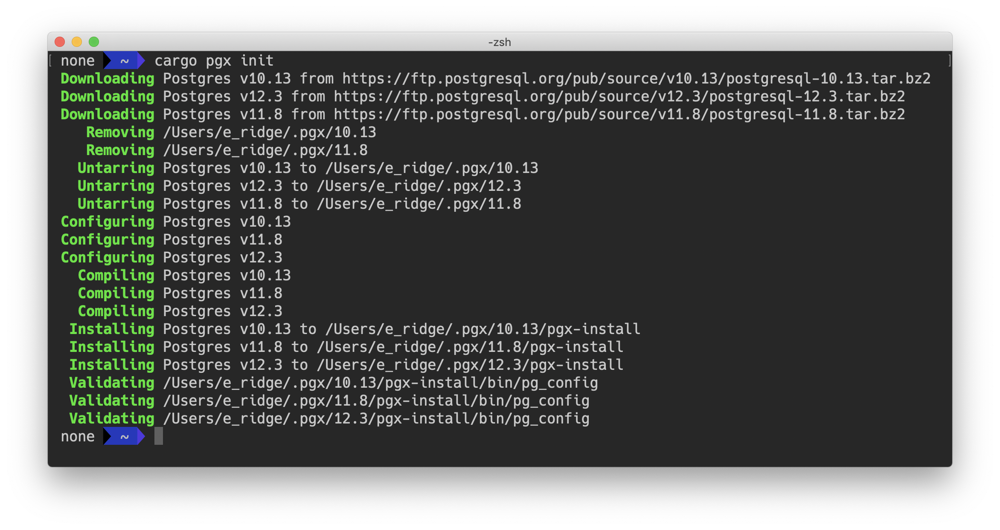
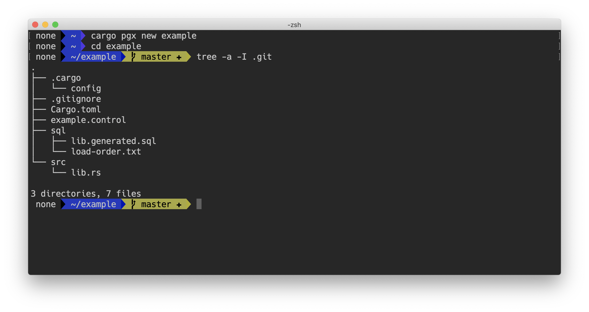
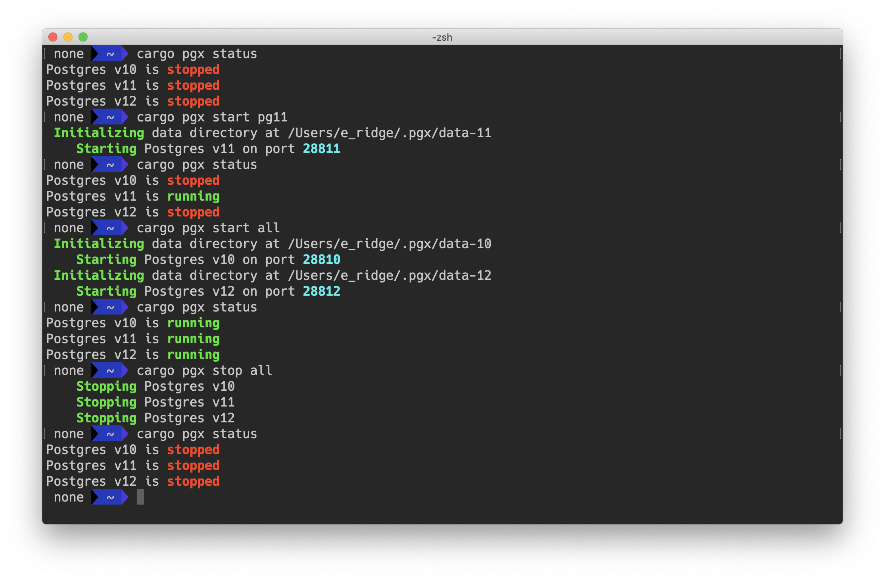
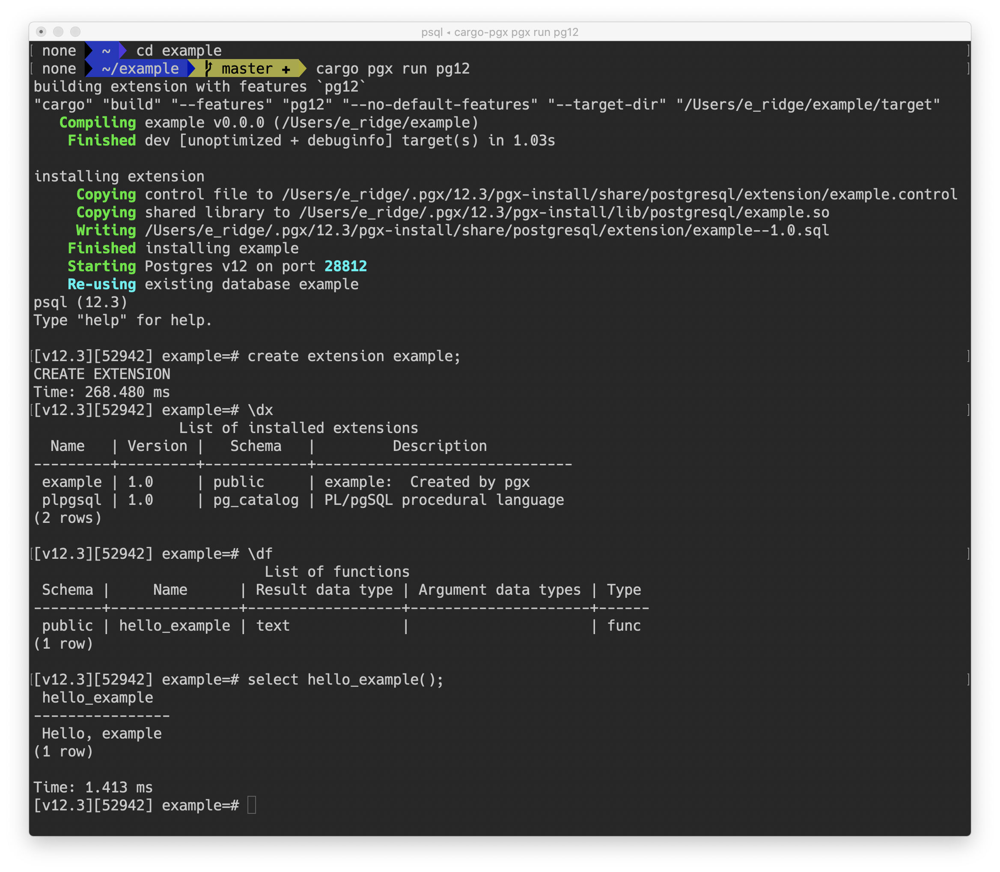
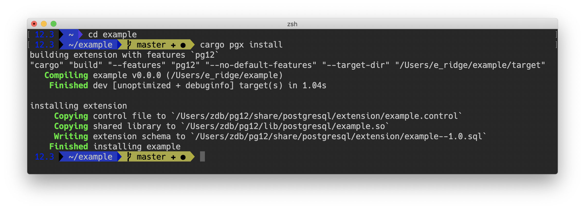
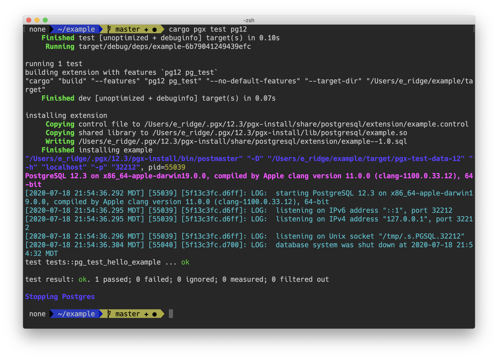
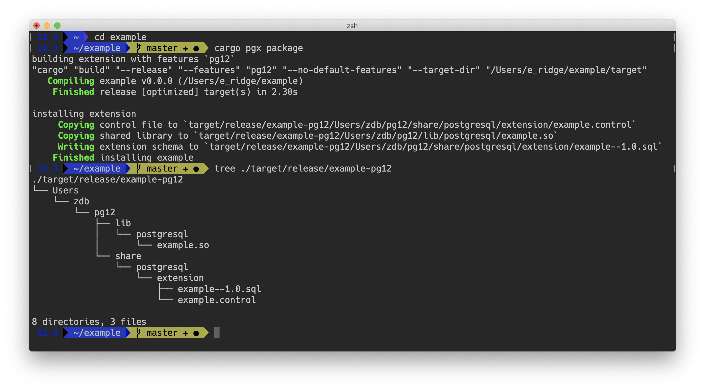

# cargo-pgx

`cargo-pgx` is a Cargo subcommand for managing `pgx`-based Postgres extensions.

You'll want to use `cargo pgx` during your extension development process.  It automates the process of creating new Rust crate projects, auto-generating the SQL schema for your extension, installing your extension locally for testing with Postgres, and running your test suite against one or more versions of Postgres.

A video walkthrough of its abilities can be found here:  https://www.twitch.tv/videos/684087991
 
## Installing

Installing via crates.io is really easy.

```shell script
$ cargo install cargo-pgx
```

As new versions of `pgx` are released, you'll want to make sure you run this command again to update it.

## Usage

```shell script
$ cargo pgx --help                
cargo-pgx-pgx 

USAGE:
    cargo-pgx pgx [SUBCOMMAND]

FLAGS:
    -h, --help       Prints help information
    -V, --version    Prints version information

SUBCOMMANDS:
    get        get a property from the extension control file
    help       Prints this message or the help of the given subcommand(s)
    init       initize pgx development environment for the first time
    install    install the extension from the current crate to the Postgres specified by whatever "pg_config" is
               currently on your $PATH
    new        create a new extension crate
    package    create an installation package directory (in ./target/[debug|release]/extname-pgXX/) for the
               Postgres installation specified by whatever "pg_cofig" is currently on your $PATH
    run        compile/install extension to a pgx-managed Postgres instance and start psql
    schema     generate extension schema files (typically not necessary)
    start      start a pgx-managed Postgres instance
    status     is a pgx-managed Postgres instance running?
    stop       stop a pgx-managed Postgres instance
    test       run the test suite for this crate
```

## Environment Variables

 - `PGX_HOME` - If set, overrides `pgx`'s default directory of `~/.pgx/`
 - `PGX_BUILD_FLAGS` - If set during `cargo pgx run/test/install`, these additional flags are passed to `cargo build` while building the extension

## First Time Initialization



`cargo pgx init` is required to be run once to properly configure the `pgx` development environment.

As shown by the screenshot above, it downloads Postgres v10, 11, 12, configures them, compiles them, and installs them to `~/.pgx/`.  Other `pgx` command such as `run` and `test` will fully manage and otherwise use these Postgres installations for you.

`pgx` is designed to support Postgres v10, 11, 12 in such a way that during development, you'll know if you're trying to use a Postgres API that isn't common across all three versions.  It's also designed to make testing your extension against these versions easy.  This is why it requires you have three fully compiled and installed versions of Postgres during development.

If you want to use your operating system's package manager to install Postgres, `cargo pgx init` has 3 optional arguments that allow you to specify where they're installed (see below). 

What you're telling `cargo pgx init` is the full path to `pg_config` for each version.

For any version you specify, `cargo pgx init` will forego downloading/compiling/installing it.  `pgx` will then use that locally-installed version just as it uses any version it downloads/compiles/installs itself.

You'll also want to make sure you have the "postgresql-server-dev" package installed for each version you want to manage yourself.

Once complete, `cargo pgx init` also creates a configuration file (`~/.pgx/config.toml`) that describes where to find each version's `pg_config` tool.

```shell script
$ cargo pgx init --help
cargo-pgx-pgx-init 
initize pgx development environment for the first time

USAGE:
    cargo-pgx pgx init [OPTIONS]

FLAGS:
    -h, --help       Prints help information
    -V, --version    Prints version information

OPTIONS:
        --pg10 <PG10_PG_CONFIG>    if installed locally, the path to PG10's 'pg_config' tool
        --pg11 <PG11_PG_CONFIG>    if installed locally, the path to PG11's 'pg_config' tool
        --pg12 <PG12_PG_CONFIG>    if installed locally, the path to PG12's 'pg_config' tool
```

## Creating a new Extension

 

`cargo pgx new <extname>` is an easy way to get started creating a new extension.  It's simlar to `cargo new <name>`, but does the additional things necessary to support building a Rust Postgres extension.

It also initializes the crate directory as a `git` repository.

```shell script
$ cargo pgx new --help
cargo-pgx-pgx-new 
create a new extension crate

USAGE:
    cargo-pgx pgx new <NAME>

FLAGS:
    -h, --help       Prints help information
    -V, --version    Prints version information

ARGS:
    <NAME>    the name of the extension
```


 
## Managing Your Postgres Installations
  

  
`cargo pgx` has three commands for managing each Postgres installation:  `start`, `stop`, and `status`.  Additionally, `cargo pgx run` (see below) will automatically start its target Postgres instance if not already running.

When starting a Postgres instance, `pgx` starts it on port `28800 + PG_MAJOR_VERSION`, so Postgres 10 runs on `28810`, 11 on `28811`, etc.  Additionally, the first time any of these are started, it'll automaticaly initialize a `PGDATA` directory in `~/.pgx/data-[10 | 11 | 12]`.  Doing so allows `pgx` to manage either Postgres versions it installed or ones already on your computer, and to make sure that in the latter case, `pgx` managed versions don't interfere with what might already be running.

`pgx` doesn't tear down these instances.  While they're stored in a hidden directory in your home directory, `pgx` considers these important and permanent database installations.

Once started, you can connect to them using `psql` (if you have it on your $PATH) like so:  `psql -p 28812`.  However, you probably just want the `cargo pgx run` command.

## Compiling and Running Your Extension



`cargo pgx run <pg10 | pg11 | pg12>` is the primary interface into compiling and interactively testing/using your extension during development.

The very first time you execute `cargo pgx run pgXX`, it needs to compile not only your extension, but pgx itself, along with all its dependencies.  Depending on your computer, this could take a bit of time (`pgx` is nearly 200k lines of Rust when counting the generated bindings for Postgres).  Afterwards, however (as seen in the above screenshot), it's fairly fast.

`cargo pgx run` compiles your extension, installs it to the specified Postgres installation as described by its `pg_config` tool, starts that Postgres instance using the same process as `cargo pgx start pgXX`, and drops you into a `psql` shell connected to a database, by default, namded after your extension.  From there, it's up to you to create your extension and use it.

This is also the stage where `pgx` automatically generates the SQL schema for your extension.  It places individual `modname.generated.sql` files into `./sql/`, and the combines those together by the order defined in `./sql/load-order.txt`.

When you exit `psql`, the Postgres instance continues to run in the background.

For Postgres installations which are already on your computer, `cargo pgx run` will need write permissions to the directories described by `pg_config --pkglibdir` and `pg_config --sharedir`.  It's up to you to decide how to make that happen.  While a single Postgres installation can be started multiple times on different ports and different data directories, it does not support multiple "extension library directories".

```shell script
$ cargo pgx run --help
cargo-pgx-pgx-run
compile/install extension to a pgx-managed Postgres instance and start psql

USAGE:
    cargo-pgx pgx run <PG_VERSION> [DBNAME]

FLAGS:
    -h, --help       Prints help information
    -V, --version    Prints version information

ARGS:
    <PG_VERSION>    Do you want to run against Postgres 'pg10', 'pg11', pg12'?
    <DBNAME>        The database to connect to (and create if the first time).  Defaults to a database with the same
                    name as the current extension name
```

## Installing Your Extension Locally



If for some reason `cargo pgx run <PG_VERSION>` isn't your style, you can use `cargo pgx install` to install your extension
to the Postgres installation described by the `pg_config` tool currently on your `$PATH`.

You'll need write permissions to the directories described by `pg_config --pkglibdir` and `pg_config --sharedir`.

By default, `cargo pgx install` builds your extension in debug mode.  Specifying `--release` changes that. 

```shell script
$ cargo pgx install --help
  cargo-pgx-pgx-install 
  install the extension from the current crate to the Postgres specified by whatever "pg_config" is currently on your
  $PATH
  
  USAGE:
      cargo-pgx pgx install [FLAGS]
  
  FLAGS:
      -h, --help       Prints help information
      -r, --release    compile for release mode (default is debug)
      -V, --version    Prints version information
```

## Testing Your Extension



`cargo pgx test [pg10 | pg11 | pg12]` runs your `#[test]` and `#[pg_test]` annotated functions using cargo's test system.

During the testing process, `pgx` starts a tempory instance of Postgres with its `PGDATA` directory in `./target/pgx-test-data-PGVER/`.  This Postgres instance is stopped as soon as the test framework has finished.

The output is standard "cargo test" output along with some Postgres log output.  In the case of test failures, the failure report will include any Postgres log messages generated by that particular test.

Rust `#[test]` functions behave normally, while `#[pg_test]` functions are run **inside** the Postgres instance and have full access to all of Postgres internals.  All tests are run in parallel, regardless of their type.

Additionally, a `#[pg_test]` function runs in a transaction that is aborted when the test is finished.  As such, any changes it might
make to the database are not preserved.

```shell script
$ cargo pgx test --help
cargo-pgx-pgx-test 
run the test suite for this crate

USAGE:
    cargo-pgx pgx test [PG_VERSION]

FLAGS:
    -h, --help       Prints help information
    -V, --version    Prints version information

ARGS:
    <PG_VERSION>    Do you want to test for Postgres 'pg10', 'pg11', pg12', or 'all' (default)?
```

## Building an Installation Package



`cargo pgx package [--debug]` builds your extension, in `--release` mode, to a directory structure in 
`./target/[debug | release]/extension_name-PGVER` using the Postgres installation path information from the `pg_config` 
tool on your `$PATH`.

The intent is that you'd then change into that directory and build a tarball or a .deb or .rpm package.

The directory structure `cargo pgx package` creates starts at the root of the filesystem, as a package-manager installed
version of Postgres is likely to split `pg_config --pkglibdir` and `pg_config --sharedir` into different base paths.

(In the example screenshot above, `cargo pgx package` was used to build a directory structure using my manually installed
version of Postgres 12.)

This command could be useful from Dockerfiles, for example, to automate building installation packages for various Linux
distobutions or MacOS Postgres installations.

```shell script
$ cargo pgx package --help
 cargo-pgx-pgx-package 
 create an installation package directory (in ./target/[debug|release]/extname-pgXX/) for the Postgres installation
 specified by whatever "pg_cofig" is currently on your $PATH
 
 USAGE:
     cargo-pgx pgx package [FLAGS]
 
 FLAGS:
     -d, --debug      compile for debug mode (default is release)
     -h, --help       Prints help information
     -V, --version    Prints version information
```